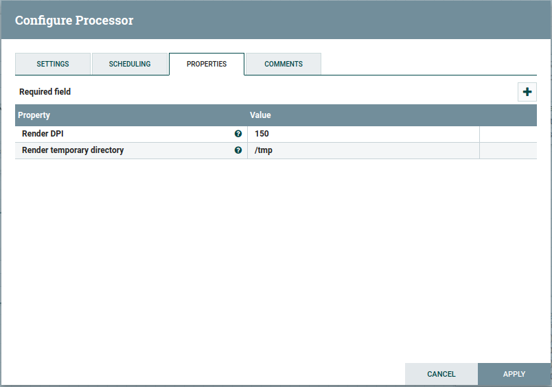

# PDF to TIFF conversion Processor for NiFi

## Build

Skip tests for now - they're not done yet.

The current version targets NiFi *1.9.2*. 

```shell script
mvn clean package -DskipTests 
```

## Install

```shell script
cp nifi-pdf2tiff-nar/target/nifi-pdf2tiff-nar-1.0-SNAPSHOT.nar $NIFI_HOME/extensions
```

## Configure & Run

Add the Processor to a new or existing NiFi Flow.


You can adjust the rendering DPI, and the directory used as a temporary cache during rendering.
Please ensure that the service user running NiFi has read/write access to this directory.



## License & copyright

(c) 2021 Lars Wilhelmsen.

Apache Public License 2.0